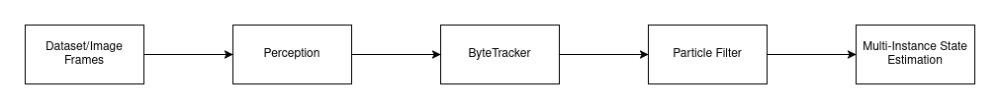
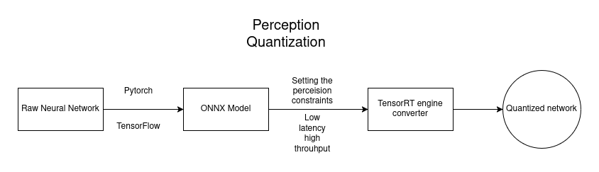
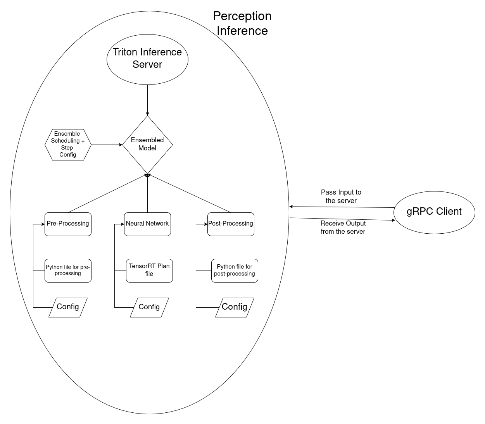
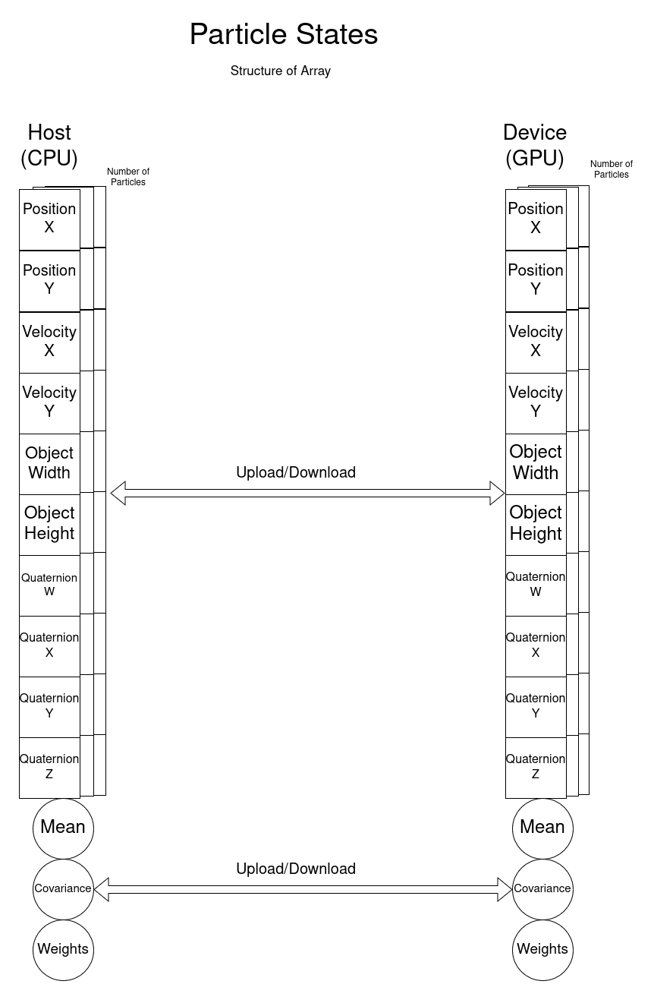
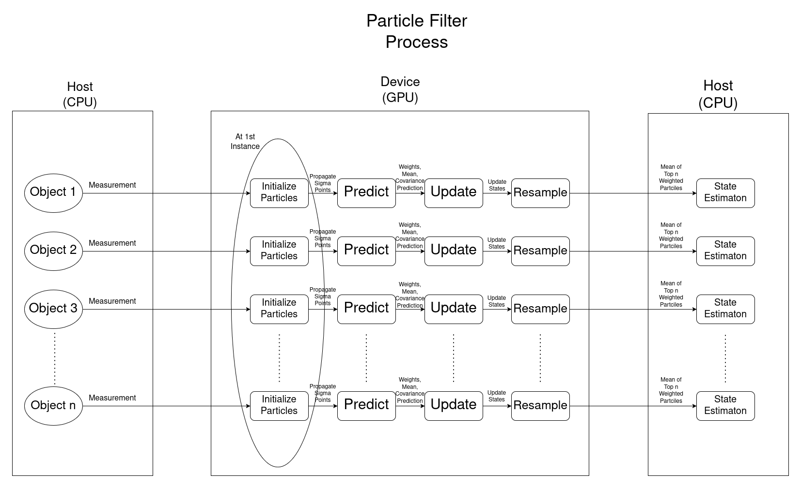

# Edge-Optimized-Tracking-System
<div align="justify">
A high-performance multi-object tracking system utilizing a quantized YOLOv11 model deployed on the Triton Inference Server, integrated with a CUDA-accelerated particle filter for robust mutiple object tracking.
</div>

<div align="center">
    
    <p>Edge-Optimized Tracking System for the SportsMOT Dataset as an example.</p>
</div>

## 🏁 Dependencies
1) [NVIDIA Driver](https://www.nvidia.com/download/index.aspx)
2) [CUDA Toolkit](https://developer.nvidia.com/cuda-downloads)
3) [NVIDIA Container Toolkit](https://docs.nvidia.com/datacenter/cloud-native/container-toolkit/latest/install-guide.html)
4) [Docker Compose plugin](https://docs.docker.com/compose/install/linux/)

*Tested on Ubuntu 22.04 and with CUDA 12.1 using RTX 4090 GPU.*

## ⚙️ Setup
### 🏋️ Pre trained weights for SportsMOT dataset
A YOLOv11s model was used, dowload the weights.

[Pretrained Weights](https://drive.google.com/uc?export=download&id=13M0WVGBIsjVfTDMfZRp0fw7apFz1Fgn1)

Extract the file and place the ```best.pt``` and ```best.onnx``` in the ```weights``` folder.

### 📊 Dataset Download
This trained network has only been trained on a single example dataset from the [SportsMOT dataset](https://github.com/MCG-NJU/SportsMOT). It was trained on the scoccer dataset instance specifically **v_gQNyhv8y0QY_c013**. 

[Sample Dataset on OneDrive from Authors](https://1drv.ms/u/s!AtjeLq7YnYGRgQRrmqGr4B-k-xsC?e=7PndU8)

Extract the folder.

## 🏗️ Building the 🐳 Docker file
Start building the docker container.
```
bash build.sh
```

Compiling the code (One time process).
```
bash compile.sh
```
## ⌛️ Running on sample data
To run the composed container with Triton and the executable.
```
DATASET_PATH=/path/to/your/dataset bash run_and_exit.sh
```
Ideally this would look like something this
```
DATASET_PATH=/home/hari/Downloads/SportsMOT_example/dataset/train/v_gQNyhv8y0QY_c013 bash run_and_exit.sh
```
*Make sure to only run on the v_gQNyhv8y0QY_c013* as it was only trained on that.

The output video gets saved in the ```/tracker_system/result``` folder.

## 📐 System Design
<details>
<summary>End-to-end Pipeline</summary>

<div align="center">
    
    <p>Overall System Design.</p>
</div>

The overall system is divided into individual sub-systems, Perception, ByteTracker, and Particle Filter. Each of the sub-systems are explained below.

</details>


<details>
<summary>Perception Design</summary>

This again is divided into two sub-components which is the one time quantization, then the setting up the ensembled network for Triton Inference Server.

#### Quantization Framework
<div align="center">
    
    <p>Quantization framework.</p>
</div>

#### Inference for Triton Inference Server using ensembled model
<div align="center">
    
    <p>Inference framework.</p>
</div>

</details>


<details>
<summary>ByteTrack Design</summary>

The [orginal authors paper](https://arxiv.org/abs/2110.06864) was used, the [Offical Reposiory](https://github.com/ifzhang/ByteTrack) gives a detailed explantion of the implementation.

</details>


<details>
<summary>CUDA Particle Filter Design</summary>

This implementation uses a complete GPU accelerated Particle Filter with an additional Unscented Transform for the prediction step.

#### Structre of Array (SoA) for the states
We use a total of 10 states.

<div align="center">
    
    <p>Particle States Structre of Array.</p>
</div>

#### CUDA Particle Filter with Unscented Transform
<div align="center">
    
    <p>Particle Filter Process on the Device(GPU) with the Unscented Transform by propogating Sigma Points.</p>
</div>

</details>

## Running on custom data
### Training on custom dataset using YOLOv11
Training script [here](scripts/train.py).

Follow the [Official Documentation](https://docs.ultralytics.com/modes/train/). There might be lack of accuracy sometimes, follow [Tuning](https://docs.ultralytics.com/guides/hyperparameter-tuning/) or use advaced frameworks like [Ray Tune](https://docs.ray.io/en/latest/tune/index.html), [WandB](https://wandb.ai/), etc.

### ONNX Conversion for YOLOv11
Conversion script [here](scripts/torch_to_onnx.py). Follow the [Official Documentation](https://docs.ultralytics.com/modes/export/) for more configurations. Manual conversions are also possible follow [Official PyTorch Tutorial](https://pytorch.org/tutorials/beginner/onnx/export_simple_model_to_onnx_tutorial.html).

### Quantize the network
There is a bash file which runs TensorRT executor [here](weights/quantize_yolo.sh), this has to be changed based on the input and output of your network architecture, also make sure to set the right percesion values if ```fp16```, ```fp32```, ```int32```, etc.

### Changing the Triton Ensemble Model
The [models](models) folder has all the entire pipeline based on the network architecture the pre-processing and post-processing files need to be changed. Typically the ```config.pbtxt``` for all the steps might require changes based on the entire peception logic. 

You can check wether the Triton is able to register you ensembled model by running ```bash run_container.sh``` and then inside running ```/opt/tritonserver/bin/tritonserver --model-repository=/models```.

### Using API for any new Perception, Tracking and Filter.
The entire [API](tracker_system/include) are defined in the files ```*_interface.hpp``` so by overriding the fucntions you can plug and play any custom solutions. 

## 📖 Citation
If you found this code/work to be useful in your own research, please considering citing the following:
```bibtex
@software{Jocher_Ultralytics_YOLO_2023,
author = {Jocher, Glenn and Qiu, Jing and Chaurasia, Ayush},
license = {AGPL-3.0},
month = jan,
title = {{Ultralytics YOLO}},
url = {https://github.com/ultralytics/ultralytics},
version = {8.0.0},
year = {2023}
}
```
```bibtex
@article{zhang2022bytetrack,
  title={ByteTrack: Multi-Object Tracking by Associating Every Detection Box},
  author={Zhang, Yifu and Sun, Peize and Jiang, Yi and Yu, Dongdong and Weng, Fucheng and Yuan, Zehuan and Luo, Ping and Liu, Wenyu and Wang, Xinggang},
  booktitle={Proceedings of the European Conference on Computer Vision (ECCV)},
  year={2022}
}
```

## 🪪 License
This software is released under BSD-3-Clause license. You can view a license summary [here](LICENSE). [Ultralytics](https://github.com/ultralytics/ultralytics) and [ByteTrack](https://github.com/ifzhang/ByteTrack) have their own licenses respectively.