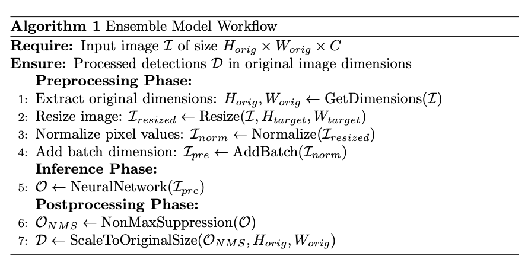
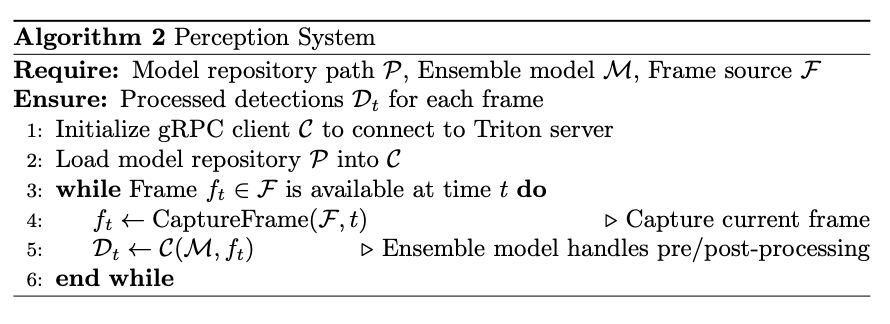
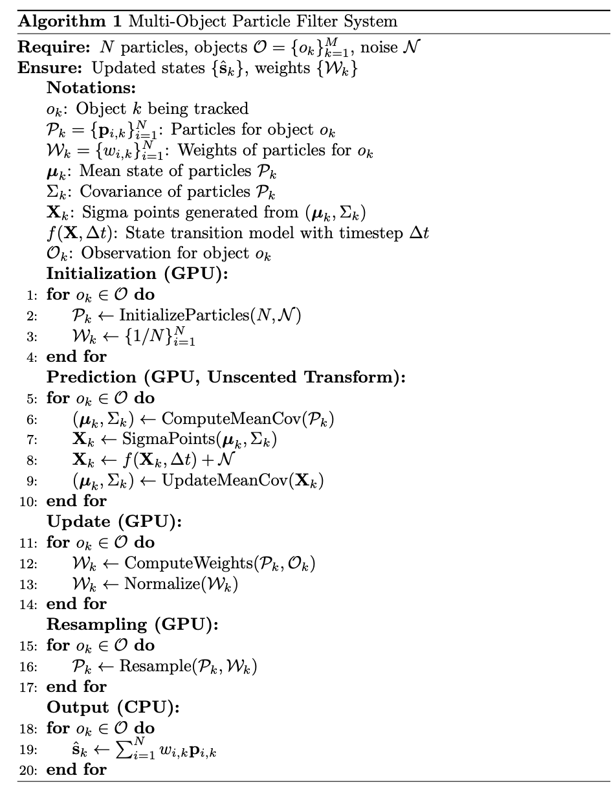

# Edge-Optimized-Tracking-System
<div align="justify">
The Edge Optimized Tracking System is a high-performance object tracking and inference pipeline designed for real-time applications. Leveraging NVIDIA's Triton Inference Server and GPU acceleration, this project combines state-of-the-art object detection, tracking, and particle filtering to achieve robust and efficient object tracking. It includes support for deep learning models, modular tracking algorithms, and advanced filtering mechanisms for precise localization and orientation estimation.
</div>

<div align="center">
    
    <p>Multi-instance tracking with localization and orientation estimation using particle filter.</p>
</div>

## 🏁 Dependencies
1) [Docker](https://docs.docker.com/engine/install/ubuntu/)
2) [NVIDIA Driver](https://www.nvidia.com/download/index.aspx)
3) [CUDA Toolkit](https://developer.nvidia.com/cuda-downloads)
4) [NVIDIA Container Toolkit](https://docs.nvidia.com/datacenter/cloud-native/container-toolkit/latest/install-guide.html)
5) [Docker Compose plugin](https://docs.docker.com/compose/install/linux/)

*Tested on Ubuntu 22.04 and with CUDA 12.1 using RTX 4090 GPU.*

## ⚙️ Setup
### Clone the Repository
```
git clone https://github.com/jagennath-hari/Edge-Optimized-Tracking-System.git
```
### Pre trained weights for SportsMOT dataset
A YOLOv11s model is used for demonstration.

[Pretrained Weights](https://drive.google.com/uc?export=download&id=13M0WVGBIsjVfTDMfZRp0fw7apFz1Fgn1)

Unzip the compressed file and place the ```best.pt``` and ```best.onnx``` in the ```weights``` folder.

### Dataset Download
The pretrained weights has been trained on a single example dataset from the [SportsMOT dataset](https://github.com/MCG-NJU/SportsMOT). It was trained on the soccer dataset specifically **v_gQNyhv8y0QY_c013** instance. 

[Sample Dataset on OneDrive from Authors](https://1drv.ms/u/s!AtjeLq7YnYGRgQRrmqGr4B-k-xsC?e=7PndU8)

A folder called ```SportsMOT_example``` gets created after extracting the file.

## 🏗️ Building the 🐳 Docker file
Start building the docker image.
```
bash build.sh
```

Compiling the code inside the container.
```
bash compile.sh
```

These need to be done only once and does not have to be repeated.
## ⌛️ Running on sample data
To run the composed container with Triton and the executable.
```
DATASET_PATH=/path/to/your/SportsMOT_example bash run_and_exit.sh
```

The output video gets saved in the ```/tracker_system/result``` folder.


## 📖 Algorithim Overview
<details>
<summary>Perception Algorithim</summary>

<table>
  <tr>
    <td align="center">
      
      <p>Ensembled Model Algorithim</p>
    </td>
    <td align="center">
      
      <p>Perception Algorithim</p>
    </td>
  </tr>
</table>

</details>

<details>
<summary>CUDA Particle Filter Algorithim</summary>

<div align="center">
    
    <p>Particle Filter Algorithim.</p>
</div>

</details>

## 📐 System Design
<details>
<summary>End-to-end Pipeline</summary>

<div align="center">
    
    <p>Overall System Design.</p>
</div>

The overall system is divided into three sub-systems, Perception, ByteTracker, and Particle Filter. Each of the sub-systems are explained below.

</details>


<details>
<summary>Perception Design</summary>

Divided into two sub-components which is the one time quantization, then the setting up the ensembled network for Triton Inference Server.

#### Quantization Framework
<div align="center">
    
    <p>Quantization framework.</p>
</div>

#### Inference for Triton Inference Server using ensembled model
<div align="center">
    
    <p>Inference framework.</p>
</div>

</details>


<details>
<summary>ByteTrack Design</summary>

The [orginal authors paper](https://arxiv.org/abs/2110.06864) was used, the [Offical Reposiory](https://github.com/ifzhang/ByteTrack) gives a detailed explantion of the implementation.

</details>


<details>
<summary>CUDA Particle Filter Design</summary>

Implementation uses a GPU accelerated Particle Filter with an additional Unscented Transform for the prediction step.

#### Structre of Array (SoA) for the states
There are a total of 10 states.

<div align="center">
    
    <p>Particle States Structre of Array.</p>
</div>

#### CUDA Particle Filter with Unscented Transform
<div align="center">
    
    <p>Particle Filter Process on the Device(GPU) with the Unscented Transform by propogating Sigma Points.</p>
</div>

</details>

## 💾 Running on custom data

<details>
<summary>Training on custom dataset using YOLOv11</summary>

Training script [here](scripts/train.py).

Follow the [Official Documentation](https://docs.ultralytics.com/modes/train/). A lack of accuracy may occur sometimes depending on the complexity of the objects, follow [Tuning](https://docs.ultralytics.com/guides/hyperparameter-tuning/) or use advaced frameworks like [Ray Tune](https://docs.ray.io/en/latest/tune/index.html), [WandB](https://wandb.ai/), etc.

</details>

<details>
<summary>ONNX Conversion for YOLOv11</summary>

Conversion script [here](scripts/torch_to_onnx.py). Follow the [Official Documentation](https://docs.ultralytics.com/modes/export/) for more configurations. Manual conversions are also possible follow [Official PyTorch Tutorial](https://pytorch.org/tutorials/beginner/onnx/export_simple_model_to_onnx_tutorial.html).

</details>

<details>
<summary>Quantize the network</summary>

A bash file which runs TensorRT executor [here](weights/quantize_yolo.sh), which may to be changed based on the input and output based on the network architecture, right percesion values are required for faster inferences eg  ```fp16```, ```fp32```, ```int32```, etc.

</details>


<details>
<summary>Changing the Triton Ensemble Model</summary>

The [models](models) folder has all the entire pipeline. Based on the network architecture the pre-processing and post-processing files need to be changed. Typically the ```config.pbtxt``` for all the steps might require changes based on the entire peception logic. 

It is recommended to check if Triton is able to register you ensembled model by running ```bash run_container.sh``` and then inside running ```/opt/tritonserver/bin/tritonserver --model-repository=/models```.

</details>


<details>
<summary>Running the Docker compose</summary>

Follow the [file](docker-compose.yml) and modify the path correctly. This should keep the entire end-to-end pipeline the same.

</details>


<details>
<summary>Using API for any new Perception, Tracking and Filter.</summary>

The entire [API](tracker_system/include) are defined in the files ```*_interface.hpp``` so by overriding the fucntions you can plug and play any custom solutions. 

</details>

## 🛠️ Final Result
<div align="center">
    
    <p>Edge-Optimized Tracking System for the SportsMOT Dataset as an example.</p>
</div>

## ⚠️ Note
1) The particle filter can be extended to other applications such as 3D tracking, but it requires changes to the state space model.
2) If running on NVIDIA Jetson, CUDA Shared Memory is not supported for Triton, the ensembled model needs to be changed as ARM uses unified memory.
3) ByteTrack may not be the best solution, more SOTA learning based trackers can yeild better correspondences.
4) The system dynamics for the particle filter use simple equations of motion, it is best to use more complex dynamics when object motions are highly non-linear.
5) The noise values may need tuning inside the particle filter.
6) Quantizing to int8 or fp16 can yeild faster inferences but at the cost of accuracy, it is a good idea to balance both, and match the applications requirements more for the ideal selection.

## 📖 Citation
If you found this code/work to be useful in your own research, please considering citing the following:
```bibtex
@software{Jocher_Ultralytics_YOLO_2023,
author = {Jocher, Glenn and Qiu, Jing and Chaurasia, Ayush},
license = {AGPL-3.0},
month = jan,
title = {{Ultralytics YOLO}},
url = {https://github.com/ultralytics/ultralytics},
version = {8.0.0},
year = {2023}
}
```
```bibtex
@article{zhang2022bytetrack,
  title={ByteTrack: Multi-Object Tracking by Associating Every Detection Box},
  author={Zhang, Yifu and Sun, Peize and Jiang, Yi and Yu, Dongdong and Weng, Fucheng and Yuan, Zehuan and Luo, Ping and Liu, Wenyu and Wang, Xinggang},
  booktitle={Proceedings of the European Conference on Computer Vision (ECCV)},
  year={2022}
}
```
```bibtex
@article{cui2023sportsmot,
  title={SportsMOT: A Large Multi-Object Tracking Dataset in Multiple Sports Scenes},
  author={Cui, Yutao and Zeng, Chenkai and Zhao, Xiaoyu and Yang, Yichun and Wu, Gangshan and Wang, Limin},
  journal={arXiv preprint arXiv:2304.05170},
  year={2023}
}
```

## 🪪 License
This software is released under BSD-3-Clause license. You can view a license summary [here](LICENSE). [Ultralytics](https://github.com/ultralytics/ultralytics) and [ByteTrack](https://github.com/ifzhang/ByteTrack) have their own licenses respectively.